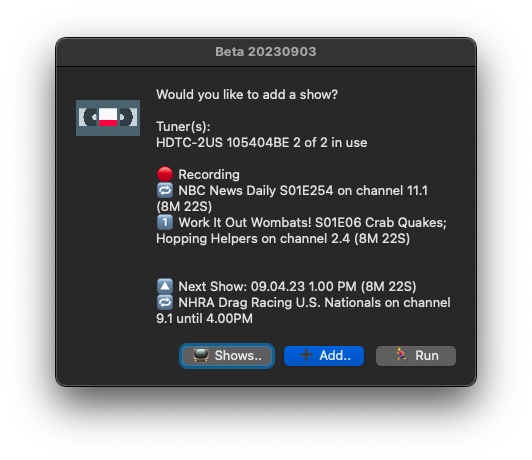
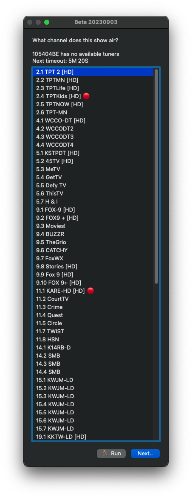
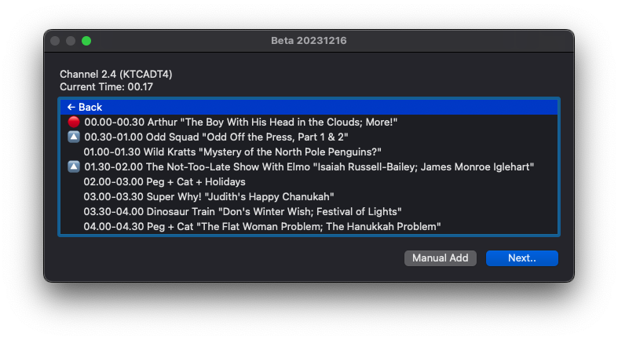
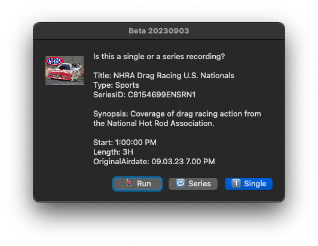

## hdhr_VCR
A pretty darn good VCR "plus" script that works on all HDHomeRun devices, and is free to use!
An OSX faceless/background script that makes recording TV shows and Movies on HDHomeRun very easy.

# Latest Release: https://raw.githubusercontent.com/identd113/hdhr_VCR-AS/20230907_Release/hdhr_VCR.applescript
 


#### Why?
I wanted a quick way to record a TV show, without setuping a large system like Plex or HDHomeRuns' own DVR software.
I call it a VCR app, as while it does use guide data to pull name / season / episode number / episode name / show length, it does not present like a normal DVR. It is more of a Smart VCR

#### Requirements
1. OSX
2. Due to poor planning, this will only work in the en_US region, sorry
2. [JSONHelper](https://apps.apple.com/us/app/json-helper-for-applescript/id453114608) is required, available for free.
3. A configured HDHomeRun device from https://www.silicondust.com
4. hdhr_VCR will also need access to the following paths:

- ~/Documents/hdhr_VCR.json
- ~/Library/Caches/hdhr_VCR/
- ~/Library/Logs/hdhr_VCR.log

#### Features
* Auto discovery of all HDHomeRun devices on your network!
* Uses built-in guide data, and lineup data, to automatically name the shows you are recording. 
* * The free guide data is only for the next 4-6 hours. We will attempt to pull fresh data right before a show starts, so in most cases, the information does get pulled correctly. I believe if you pay for HDHomeRuns own DVR software, the guide data is much longer, and the script would handle that.
* Runs in the background, but allows easy editing of existing saved shows.
* Uses caffeinate to ensure that the system does not go to sleep during a recording.
* Add a show or series in 10 seconds.
* Robust logging, allows you to see exactly what is happening on the script at any time.

### How to use
1. Download the file hdhr_VCR.applescript, and open this in Script Editor.
2. Choose "Export..." in the File Menu.
3. Save as "Application" and check "Stay open after run handler" **MUST** be checked for this to work.
4. Save the file with the name hdhr_VCR, and then save this in the Application Folder.
5. Now we have a compiled application, we want to open it.

When you first run this, OSX will prompt multiple times for various system permissions. Please grant all of these.

6. You will then be presented with options to see the existing shows, add a show, or "Run" 
* More about "Run" later.

Let's start with "Add", as this is the main function.



7. If you have multiple tuners, you will be asked which one you would like to use for this recording.
8. You will be presented with a channel list. Select the channel this show is on.



10. Once you select your channel, you will see a screen that details the shows that are on in the next ~ 4 hours.


11. You will notice that there is a "Manual Add" option. This will allow you to select a time past the 4 hours of guide data provided. If you wish to follow this route, you can skip to https://github.com/identd113/hdhr_VCR-AS#manual-add

Select a show, and click "Next"



* A "Single" is a one-off recording. Once the recording is complete, the show will be marked as inactive.
* If you selected a "Series" you can select as many days of the week you would like to record. This will repeat every week.


You will then select where you want the file to be saved. The default location is "/Volumes/", but you will need to select a specific location. Any attempts to select "/Volumes/" as the destination will re prompt you for a valid location.

If you own a "Extend" device, or a device that has transcode capabilities, you can select which profile you wish to use.

#### Manual Add
If you wish to schedule a recording outside of the 4 hour guide window, you can select Manual Add, and add this show/series.

You will then be asked to specify a time, it is done a bit strangely. We use 24 hour decimal time
* For example, if you wanted to record a show at 6:45 PM, you would enter 18.75. (.5 of an hour, is 30 minutes. .75 of an hour is 45 minutes.)
* If you attempt to use a time that has already passed for today, it will assume you mean tomorrow.
* When picking a time, you can select anytime during the show time span, and we will adjust the start time to align with the real start. For example, if a certain show starts at 10:35 PM, and the show runs 62 minutes, you could enter any time between 22.56 to 23.58, and we would set the start time to 22.56 (10:35)

You will now have the ability to set the recordings name. The name provided is just temporary, as we will try to pull the guide data right before the recording starts. 

13. In this same window, you will also tell the script if this is a a "Single" or a "Series"

* A "Series" is meant for shows that air at the same time, perhaps 1 day or week, or 7, at a certain time.
14. The next screen allows you to tell us which day you wish to record. It will default to today.
* If you selected a "Series" you can select as many days as you wish.
* If you select "Single" you can only select one day.

This allows you to set up a recording up to a week in advance.

#### END Manual Add


#### What is Run?

> "You told me you would tell me what "Run" is for?

The button that shows "Run" in almost all dialogs, will drop you back into the idle() handler. This can be used to go back, or start over, for example if entering the incorrect information when adding a show.  This allows the script to run as needed. It is important to know that the idle() is NOT running when a dialog is open. If a dialog stays open forever, we will never be able to record, or update anything in the script. Because of this, dialogs have a timeout of 60 seconds, before auto closing. The choose from list dialog can NOT be dismissed automatically. Our use case is the show info list.

> "I did that, but nothing happens!"

That is accurate. When the script is configured with a show, it is faceless, and you do not need to do anything, other than allow it to run.

> "I want to add or edit a show"

If you click the icon in the Dock, you will be presented with the main window, so you can do such things.

> "How do I know something is happening?

We use notifications to alert the user to recordings being started, in progress, and completing. This may cause lots of notifications to occur, if a lot of shows are scheduled. If there is a better way to be able to tell the user something, let me know.

> "I need to quit the script, but I have a recording in progress"

If you want to quit the script, the best way to do so is being in a "run" state (faceless) and then issuing a command q, or selecting "Quit" from the hdhr_VCR File menu.
* If a show is currently recording, you will be prompted regarding if you want to cancel the recordings, before quitting. You can choose to go back to the main screen, quit, and cancel all recordings, or quit, but do not cancel the shows. Since the recording is done with "curl", hdhr_VCR does not need to be open once a recording has already started.


**In almost every case, you should choose "No". **

## Nitty gritty 
Uses records to store complex data sets. 

This is an example of a what data of a show recording contains:

```
{show_title:Curious George S01E21 Surprise Quints; Muddy Monkey, show_time:16, show_length:30, show_air_date:Monday, Tuesday, Wednesday, Thursday, Friday, show_transcode:None, show_temp_dir:alias Raid3:DVR Tests:, show_dir:alias Raid3:DVR Tests:, show_channel:2.4, show_active:true, show_id:0489dfb9fd492970694c13d25e2f457a, show_recording:false, show_last:date Tuesday, June 15, 2021 at 4:30:00 PM, show_next:date Wednesday, June 16, 2021 at 4:00:00 PM, show_end:date Wednesday, June 16, 2021 at 4:30:00 PM, notify_upnext_time:missing value, notify_recording_time:missing value, show_is_series:true, hdhr_record:105404BE}
```

Example of a tuner record:

```
{hdhr_lineup_update:missing value, hdhr_guide_update:missing value, discover_url:http://10.0.1.101/discover.json, lineup_url:http://10.0.1.101/lineup.json, device_id:DEADBEEF, does_transcode:1, hdhr_lineup:missing value, hdhr_guide:missing value, hdhr_model:missing value, channel_mapping:missing value, BaseURL:http://10.0.1.101, statusURL:http://10.0.1.101/status.json}
```

The hdhr_guide and hdhr_lineup contain the entire json result of the lineup, and guide data. We use this as a cache, so we only make a "new" API call every 2 hours, or when a show starts recording.

## Special considerations
* The "heavy lifting" is done with curl, which downloads the data to a local drive. The script manages the show and device logic.
* If there are multiple HDHR device on the network, you will be asked which one you want to use when adding a show.
* When adding a show, we will attempt to write a test file to that location (and remove it) right away, so we can get through any of the OS X disk access prompts. This file is written/removed every 5 minutes during a recording. This will update the file size, as seen in Finder.
* We use notifications to alert the user to imminent events
* * 1 hour before the show, and then every 15 minutes
* * Starting a recording
* * Every 15 minutes during a recording
* * End of a recording

* If the system is restarting or shutting down, we will see that, and not prompt the user cancel the recordings, they will just be canceled.

hdhr_VCR now has a logger, which by default is named hdhr_VCR.log, that gives us more information of what is happening, without flooding the notifications.
 

I hope this can be collaborative project, so other options that you use can be added.

-MikeW